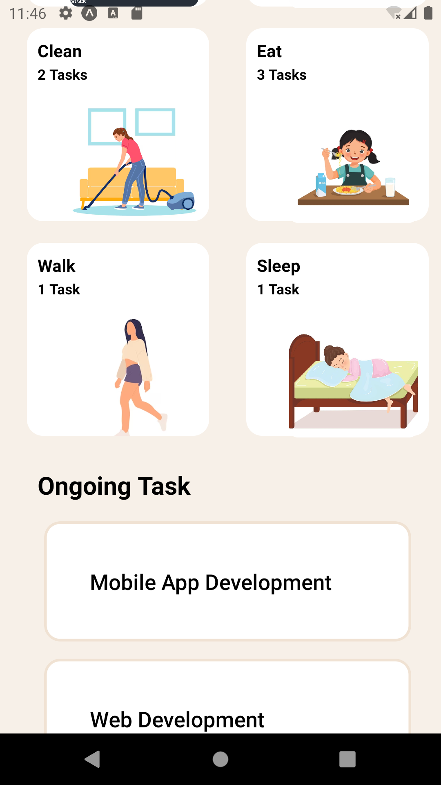

# -rn-assignment3-11179865

My Componets are App.js,OngoingTask.js and Categories.js with App.js being the main page housing the other components.
OngoingTask.js shows the tasks that the user has started partaking in
Categories shows the tasks that need to be performed.When Categories is pressed,the tasks like exercises,cook ,code ,eat, and others show on the page ,
making the app interactive.

SCREENSHOT OF APP
   
